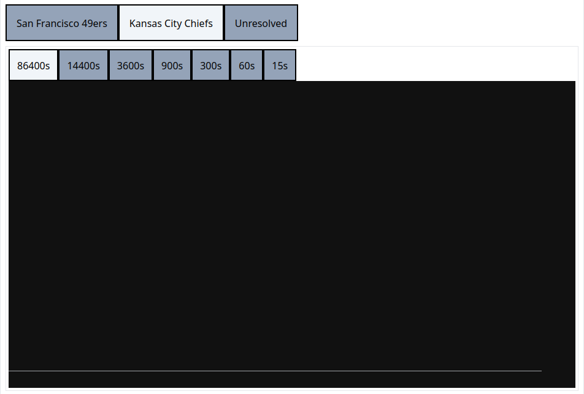
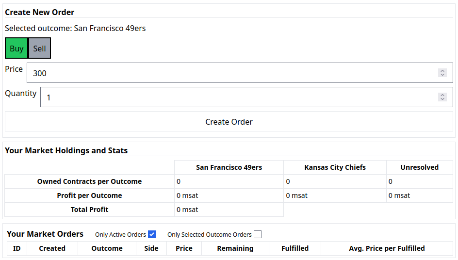

# Webimint Prediction Markets Walkthrough

### Explanation of the prediction market implemented
A market has a contract price and a number of outcomes. Each outcome has its own order book of buys and sells.

In order for a new contract to be created, buy's prices from all outcomes must add up to the contract price. When this happens, contracts of each buy's outcome are handed out to the buys.

For a contract to be destroyed, sell's prices from all outcomes must add up to the contract price.

Contracts of each outcome can also be swapped locally in each outcomes order book. New orders will always pick the best price between creating/destroying vs swapping.

To find the probability that a given outcome price represents, simply divide the price by the contract price. 

## UI Walkthrough

### Payout Controls Tab

A payout control is a keypair that allows users to propose payouts for a market. This tab shows your payout control public key and allows you to assign names to payout controls. It is recommended to assign a name like "self" to your payout control.

### New Market Tab

This tab allows users to create new markets. Above is an example market representing the NFL Super Bowl. Market terms and operation is discussed more in the [view market tab](#view-market-tab) section.

Above shows an example of a new market with a threshold payout. 2 of the 3 payout controls (self, alice, and bob) must agree on the payout before it occurs.

### View Market Tab

On entering the view market tab, a couple options are given for going to the market you desire. You may go to a market directly by id. The saved markets tab shows a table of markets you have saved that you may go to by simply clicking. The client payout control markets tab shows markets that your payout control has some weight over the payout on.

Above is what is shown first when entering a market page.

#### Definitions:
* ***ID***: txid of the fedimint transaction that created the market
* ***Contract price***: The amount the market holds for each contract issued. [See explanation of prediction markets](#explanation-of-the-prediction-market-implemented)
* ***Payout control's fee per contract***: Amount of the contract price that is given to the payout controls per open contract at payout.
* ***Current open contracts***: The number of contracts open on the market.
* ***Cumulative agreeing weight required for payout***: How much payout control weight must agree for a payout to occur.

The payout sections shows the status of the market payout. It also show a "propose a payout" section if your payout control has any weight in the market. The payout splits the contract price minus the payout control's fee per contract amongst the outcomes. Notice that one outcome does not necessarily have to recieve the entirety of the payout.

Above is an example payout proposal and result.

The next section of the market page has an outcome selector. This decides which price chart is shown in the candlestick chart just below as well as which outcome new orders are created on. The candlestick chart also has a selector for the time interval you would like to view.

The last section of the market page gives you the ability to create new orders as well as view your created orders statuses. A general summary of your market position is also shown. 

